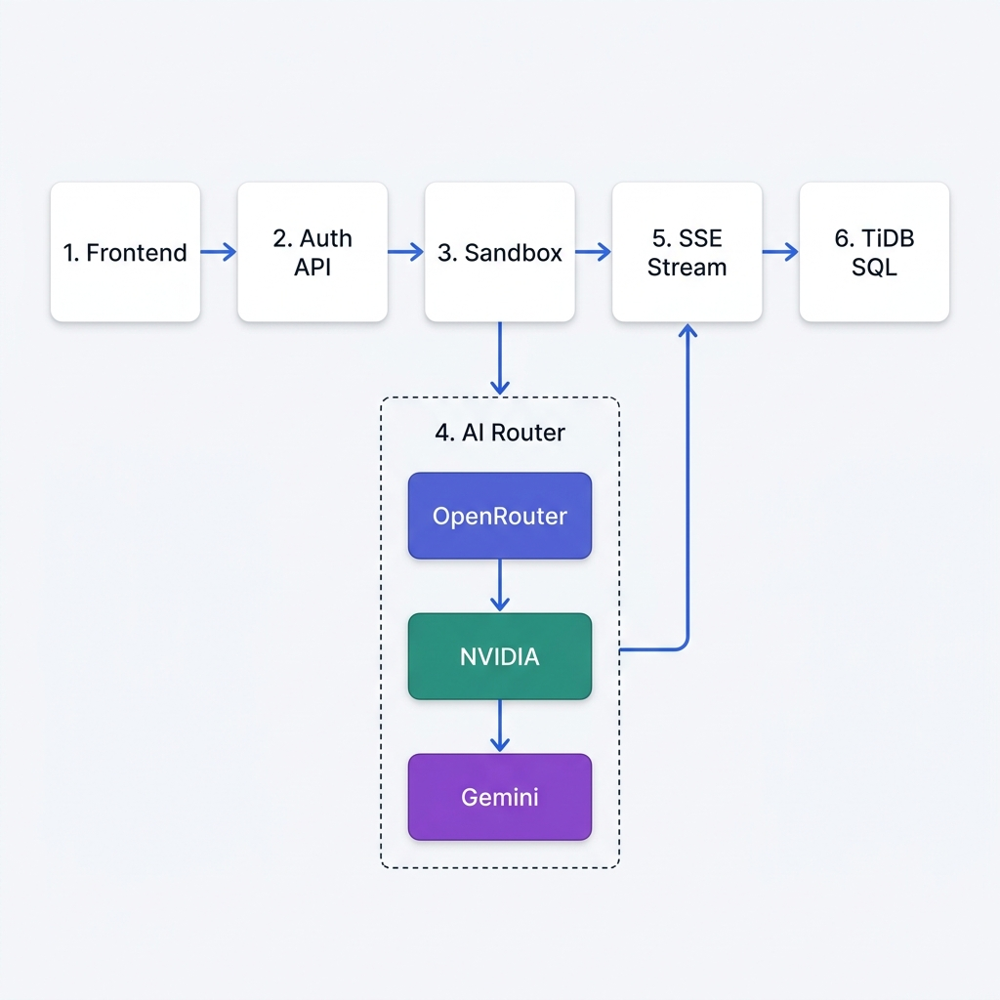

<div align="center">


# ⚡ CodeMentor AI

### *Your AI-powered pair programmer — paste any code or an github repository URL and get an instant, structured explanation.*

**[🔴 Live Demo: CodeMentor AI on Render](https://codementorai-gd4s.onrender.com)**

[Features](#-features) · [Tech Stack](#-tech-stack) · [Multi-Model Router](#-multi-model-ai-router) · [Getting Started](#-getting-started) · [How Input Works](#-how-program-input-works) · [API Reference](#-api-reference) · [Deployment](#-deployment)

</div>

---

## 🎯 What is CodeMentor AI?



CodeMentor AI is a web-based learning tool that takes any code snippet (or an entire public GitHub repository) and explains it in plain English, line by line, using a powerful **Multi-Model AI Router**. It is designed for students, bootcamp learners, and developers who want to understand unfamiliar code fast.

> **Why is it different from an IDE?**
> A traditional IDE (VS Code, IntelliJ, etc.) helps you *write* code. CodeMentor AI helps you *understand* code. Instead of autocomplete and linting, it gives you analogies, structured breakdowns, language-specific mentor tips, and a persistent chat interface where you can ask follow-up questions about any part of the code.

---

## ✨ Features

| Feature | Description |
|---|---|
| 🧠 **AI Code Explanation** | Structured breakdowns with real-world analogies and mentor tips |
| 💬 **Follow-up Chat** | Ask questions about any part of the explanation |
| 🐙 **GitHub Repo Explainer** | Paste a public GitHub URL to explain an entire repository |
| ▶️ **Live Code Runner** | Run code directly in the browser (powered by Wandbox cloud compiler) |
| 📚 **11 Languages** | Python, JavaScript, TypeScript, Java, C, C++, C#, Go, Rust, Ruby, PHP |
| 📊 **Personal Dashboard** | Tracks your total explanations and languages explored |
| 🕑 **History** | Revisit any past explanation session with its full chat |
| 🌙 **Dark / Light Mode** | Beautiful dark-first UI with a one-click theme toggle |
| 🔐 **Secure Auth** | JWT-based authentication with bcrypt password hashing |

---

## 🛠 Tech Stack

| Layer | Technology |
|---|---|
| **Frontend** | Vanilla HTML, CSS, JavaScript - no framework needed |
| **Code Editor** | [Monaco Editor](https://microsoft.github.io/monaco-editor/) (same engine as VS Code) |
| **AI Provider** | **Multi-Model Router** (OpenRouter: Hermes/Llama/Qwen ➔ NVIDIA Llama ➔ Gemini) |
| **Backend** | Python 3.12 + [FastAPI](https://fastapi.tiangolo.com/) |
| **Database** | [TiDB Cloud](https://tidbcloud.com/) (MySQL-compatible) via SQLAlchemy |
| **Auth** | JWT tokens (python-jose) + bcrypt password hashing (passlib) |
| **Cloud Compiler** | [Wandbox](https://wandbox.org/) API — sandboxed, no local execution |
| **Streaming** | Server-Sent Events (SSE) for real-time AI response streaming |

---

## 🧠 Multi-Model AI Router

To ensure the highest quality code explanations, CodeMentor AI does not rely on just one AI model. Instead, it uses a **Multi-Model Router** configured in `app/services/gemini_service.py`. The router automatically cycles through the best available models based on the API keys provided in your `.env` file.

The fallback chain is designed to prioritize models with exceptionally high coding and reasoning capabilities, finally falling back to Gemini for ultimate reliability:

1. **Choice 1 (OpenRouter Free)**: `nousresearch/hermes-3-llama-3.1-405b:free` (Massive, top-tier coding logic).
2. **Choice 2 (OpenRouter Free)**: `meta-llama/llama-3.3-70b-instruct:free` (Extremely fast, excellent reasoning).
3. **Choice 3 (OpenRouter Free)**: `qwen/qwen3-coder:free` (Specialized coding model).
4. **Choice 4 (NVIDIA)**: `nvidia/llama-3.3-nemotron-super-49b-v1` (Highly capable, fast). Requires `NVIDIA_API_KEY`.
5. **Choice 5 (OpenRouter Free)**: `google/gemma-4-31b-it:free` (Google's powerful open model).
6. **Choice 6 (Google Gemini)**: The ultimate reliable fallback. Free tier is generous and fast. Requires `GEMINI_API_KEY`.

If a model rate-limits or fails, the router seamlessly moves to the next model in the chain without interrupting the user.

---

## 🚀 Running Locally

### Prerequisites

- Python 3.12+
- A MySQL or TiDB Cloud database
- A [Google Gemini API key](https://aistudio.google.com/apikey) (free tier available)

### Local Setup

```bash
# 1. Clone this repository
git clone https://github.com/Kathan472/CodeMentorAI.git
cd CodeMentorAI

# 2. Create and activate a virtual environment
python3 -m venv venv
source venv/bin/activate      # macOS/Linux
# venv\Scripts\activate       # Windows

# 2. Install dependencies
pip install -r requirements.txt

# 3. Set up environment variables
cp .env.example .env
# Edit .env and fill in your DATABASE_URL, GEMINI_API_KEY, and JWT_SECRET

# 4. Start the server (database tables are created automatically on first run)
uvicorn app.main:app --reload
```

Open your browser at **http://localhost:8000** to view the app locally.

---

## 📥 How Program Input Works

CodeMentor AI uses **[Wandbox](https://wandbox.org/)** as its cloud compiler. Wandbox runs your code in a safe, isolated sandbox on their servers — your machine never executes any user code.

### 📝 The Code Editor (Monaco)
CodeMentor AI uses the **Monaco Editor**, which is the exact same underlying engine that powers **Visual Studio Code**. 
Because it is a professional-grade editor, it provides:
- **Syntax Highlighting** for all 11 supported languages.
- **Smart Indentation & Formatting** based on the language context.
- **Line numbers and minimaps** for easy navigation.
- **No autocomplete by design!** We intentionally disabled heavy language servers (like IntelliSense) because CodeMentor AI is a learning tool. You are meant to read, paste, or write code to understand it, rather than rely on the editor to write it for you.

### ⚠️ Important: Code Execution (Wandbox) is NOT Interactive
CodeMentor AI does not execute code on your local computer. When you press **Run**, your code is sent to [Wandbox](https://wandbox.org/), a secure, sandboxed cloud compilation service.

Because the code runs in the cloud and returns the result all at once, **it cannot prompt you for input interactively**. 

If your program expects user input (like `input()` in Python or `Scanner` in Java), you **MUST** provide all of that input upfront using the **Standard Input (stdin)** text area located directly beneath the code editor. The text you type there is sent to Wandbox as a pre-filled file, which the program reads from instantly.

---

### ✅ Examples of How to Provide Input Correctly

You must type all your inputs in the **Standard Input** box, **one input per line**, in the exact order your program asks for them.

#### Example 1: Python
**Code:**
```python
name = input("Enter your name: ")
age = int(input("Enter your age: "))
print(f"Hello {name}, you will be {age + 1} next year.")
```
**What to type in the Standard Input box:**
```text
Alice
25
```
**Output:** `Hello Alice, you will be 26 next year.`

#### Example 2: Java
**Code:**
```java
import java.util.Scanner;
public class Main {
    public static void main(String[] args) {
        Scanner sc = new Scanner(System.in);
        int a = sc.nextInt();
        int b = sc.nextInt();
        System.out.println("Sum is: " + (a + b));
    }
}
```
**What to type in the Standard Input box:**
```text
10
15
```
**Output:** `Sum is: 25`

#### Example 3: Go (Golang)
**Code:**
```go
package main
import "fmt"

func main() {
    var firstName, lastName string
    fmt.Scan(&firstName, &lastName)
    fmt.Printf("Welcome to Go, %s %s!\n", firstName, lastName)
}
```
**What to type in the Standard Input box:**
```text
John
Doe
```
**Output:** `Welcome to Go, John Doe!`

#### Example 4: JavaScript (Node.js)
Node.js reading from stdin is a bit more manual since there is no built-in `prompt()`. Wandbox runs standard Node.js.
**Code:**
```javascript
const fs = require('fs');
// Read all pre-filled input from stdin (file descriptor 0)
const input = fs.readFileSync(0, 'utf-8').trim().split('\n');

const name = input[0];
console.log(`Hello, ${name}!`);
```
**What to type in the Standard Input box:**
```text
JavaScript Developer
```
**Output:** `Hello, JavaScript Developer!`

---

### ❌ What happens if you forget to provide input?

Because running code in the cloud without providing standard input causes unpredictable behavior—such as `EOFError` crashes in Python, or infinite loops with garbage memory in C++—CodeMentor AI has a built-in **Educational Safety Check**.

If you leave the Standard Input box completely empty, our backend scans your code for common input statements (like `cin >>`, `input()`, `Scanner`, `scanf`). If it finds them, it immediately **intercepts the execution** and throws a custom warning:

> **CodeMentor AI Warning:** Your [Language] code contains input statements, but you left the 'Standard Input' box empty.
> Because this code runs in the cloud, it cannot prompt you interactively. If we run this, it will immediately hit an EOF (End of File) error or read garbage memory.
> 👉 Please type your inputs into the 'STANDARD INPUT' box before clicking Run!

**Golden Rule:** Always check if the code you are pasting contains an input statement. If it does, pre-fill the Standard Input box before clicking Run!

### 🌩️ Troubleshooting: "Resource temporarily unavailable"
If you click **Run** and immediately get an error that looks like this:
```text
Compiler Error:
ERROR (catatonit:1): failed to fork child: Resource temporarily unavailable
ERROR (catatonit:1): failed to spawn pid1: Resource temporarily unavailable
```
**Do not panic!** This is a generic cloud infrastructure error from the Wandbox servers, meaning they are temporarily under heavy load and out of containers. **It affects all languages.** It has nothing to do with your code—just wait a minute or two and click Run again.

### 🔍 How this differs from a real IDE

| Feature | CodeMentor AI | Traditional IDE (VS Code, IntelliJ) |
|---|---|---|
| **Input method** | Pre-filled stdin box | Type live directly in the terminal |
| **Interactive prompts** | ❌ Not supported | ✅ Supported (program waits for you) |
| **Execution location** | Secure cloud servers (Wandbox) | Your local CPU & RAM |
| **Code Completion** | ❌ Disabled for learning | ✅ IntelliSense / Autocomplete |
| **Primary Purpose** | To read, analyze, and understand code | To write and ship production code |


## 📁 Project Structure

```
CodeMentorAI/
├── app/                        # FastAPI backend
│   ├── main.py                 # App entry point, router registration
│   ├── database.py             # SQLAlchemy engine & session
│   ├── models.py               # ORM models (User, Submission, ChatHistory, UserStats)
│   ├── schemas.py              # Pydantic request/response schemas
│   ├── prompts.py              # Language-specific AI system prompts
│   ├── routes/
│   │   ├── auth.py             # /api/auth/signup, /api/auth/login
│   │   ├── chat.py             # /api/chat/explain, /api/chat/followup, /api/chat/{id}
│   │   ├── dashboard.py        # /api/dashboard/stats
│   │   ├── execute.py          # /api/code/execute (Wandbox proxy)
│   │   └── submissions.py      # /api/submissions
│   ├── services/
│   │   └── gemini_service.py   # Gemini + fallback AI provider logic
│   ├── middleware/
│   │   └── auth.py             # JWT authentication dependency
│   └── utils/
│       ├── security.py         # Password hashing & JWT creation
│       └── github_fetcher.py   # Downloads & extracts public GitHub repos
├── frontend/                   # Vanilla HTML/CSS/JS frontend
│   ├── index.html              # Main page
│   ├── styles.css              # All styles (dark mode, glassmorphism, animations)
│   └── app.js                  # All frontend logic (auth, editor, streaming, history)

├── tests/                      # Automated tests
├── .env.example                # Environment variable template (copy to .env)
├── .gitignore                  # Excludes .env, venv, __pycache__, etc.
├── requirements.txt            # Python dependencies
└── README.md                   # This file
```

---

## 🚢 Deployment

CodeMentor AI is deployed as a **self-contained monorepo**, meaning the frontend and backend run together as a single service. 

- **Hosting:** The application is deployed on **Render** as a Web Service.
- **Database:** The database is hosted on **TiDB Cloud** (a MySQL-compatible distributed database).
- **Architecture Benefits:** 
  - **Zero CORS Issues**: Because the frontend and backend share the exact same domain, there are no cross-origin errors to configure.
  - **Single Source of Truth**: One git push deploys the entire application.
  - **Cost Effective**: Runs on a single web service instance.

Once deployed, the FastAPI backend automatically mounts the `frontend/` directory and serves `index.html` at the root URL (`/`).

---


## 📄 License

This project is licensed under the MIT License — see the [LICENSE](LICENSE) file for details.

---
